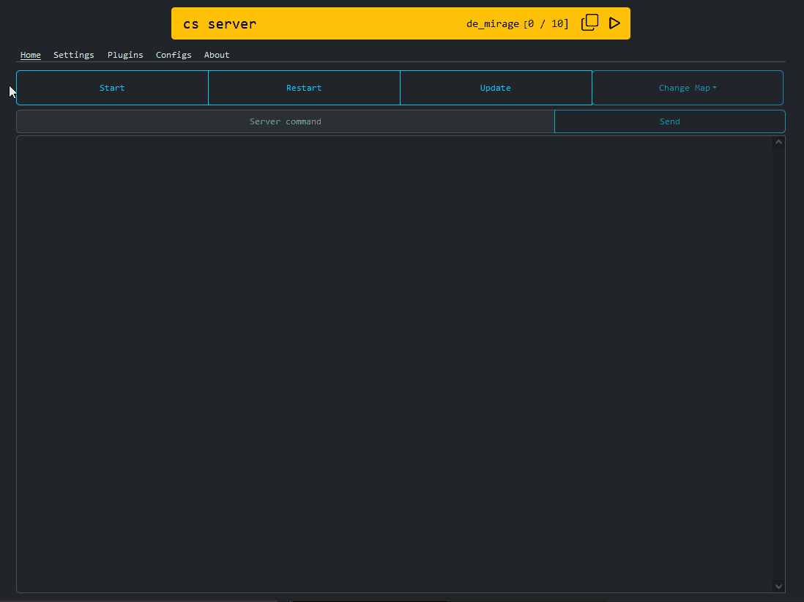

# cs-server-manager

## :warning: This project is under active development.<br/>:warning: Expect bugs and breaking changes

## :warning: This project is designed to only run on linux (for now)<br/>For development under Windows use WSL

<br/>

# API [DOCUMENTATION](api-documentation.md)

Default API path: `/api/v1`

Default Swagger UI path: `/api/swagger/index.html`

> Local development example URLs:
> API logs endpoint: [http://localhost:8080/api/v1/logs/100](http://localhost:8080/api/v1/logs/100) > <br/>
> swagger URL: [http://localhost:8080/api/swagger/index.html](http://localhost:8080/api/swagger/index.html)

---

# Web UI

The Web UI is hosted by default under the base path

> Local development example URL: [http://localhost:8080](http://localhost:8080)



---

# Commands

> All commands should be run from the root of this repo

## Build

```
npm install --prefix frontend/
npm run build --prefix frontend/

cp -R frontend/dist backend/web

swag init --dir backend/ --output backend/docs
cp backend/docs/swagger.json backend/swagger-ui/swagger.json

go mod tidy -C backend/
go mod verify -C backend/
go mod download -C backend/
go build -C backend/ -v -o cs-server-manager
```

## Docker

```
docker build -t cs-server-manager .
docker run -it --rm --name cs-server-manager --mount type=bind,source=/cs-server-manager,destination=/data -p 8080:8080 -p 27015:27015 cs-server-manager
```

## Generate swagger docs with [swaggo/swag](https://github.com/swaggo/swag)

```
go install github.com/swaggo/swag/cmd/swag@v1.16.3
swag init --dir backend/ --output backend/docs
```

## Generate api-documentation.md with [widdershins](https://github.com/Mermade/widdershins)

> Requires generated swagger docs

```
npm install widdershins@v4.0.0
npx widdershins -v --code --summary --expandBody --omitHeader -o api-documentation.md backend/docs/swagger.json
```

# Environment variables

> Those environment variables can also be set via an `.env` file.
> <br/>
> It should be located in the same folder as the `cs-server-manager` binary or in the `backend` folder for development

| KEY            | TYPE   | DEFAULT             | DESCRIPTION                                                                                                                           |
| -------------- | ------ | ------------------- | ------------------------------------------------------------------------------------------------------------------------------------- |
| IP             | string | current public IP   | This IP is returned with the status endpoint to generate the connection url.<br/>If no specified, the current public ip will be used. |
| HTTP_PORT      | string | 8080                | The API / WebSocket port                                                                                                              |
| CS_PORT        | string | 27015               | CS 2 server port. This port will be reported with the status endpoint to generate the connection URL                                  |
| DATA_DIR       | string | /data               | The base data directory for all CS server files                                                                                       |
| LOG_DIR        | string | {DATA_DIR}/logs     | Location of the CS server logs                                                                                                        |
| SERVER_DIR     | string | {DATA_DIR}/server   | The CS 2 server directory.<br/>After installation this folder will be around 30 GB is size                                            |
| STEAMCMD_DIR   | string | {DATA_DIR}/steamcmd | The steamcmd directory                                                                                                                |
| ENABLE_WEB_UI  | bool   | true                | If set to true, the backend will host the WEB UI                                                                                      |
| ENABLE_SWAGGER | bool   | true                | If set to true, the backend will host the swagger UI                                                                                  |
